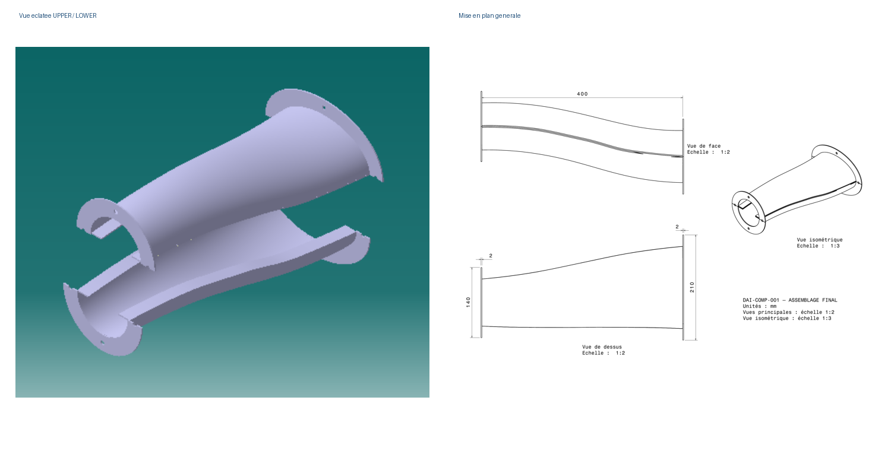

# DAI-COMP-001 — Duct Air Inlet composite


Projet personnel d’ingénierie aéronautique combinant conception paramétrique sous CATIA V5, prévalidation CFD sous ANSYS Fluent, préparation pédagogique de l’industrialisation composite et analyse qualité sur données synthétiques.
<p align="center">
  
</p>

---

## Présentation du projet

Le projet **DAI-COMP-001** porte sur la conception et l’évaluation d’un conduit d’entrée d’air composite constitué de deux demi-coquilles assemblées par collage longitudinal.

L’objectif principal est de relier plusieurs activités d’ingénierie autour d’un même produit :

- définir les exigences fonctionnelles et géométriques ;
- concevoir un modèle paramétrique sous CATIA V5 ;
- créer les demi-coquilles UPPER et LOWER ;
- vérifier l’assemblage et les interfaces ;
- préparer le domaine fluide pour la simulation ;
- étudier l’écoulement interne sous ANSYS Fluent ;
- comparer plusieurs niveaux de maillage ;
- proposer un scénario pédagogique de fabrication composite ;
- développer une PFMEA et un Plan de contrôle ;
- réaliser des analyses MSA, SPC et de capabilité sous Python et Excel ;
- documenter les hypothèses, résultats et limites du projet.

Ce dépôt présente une **étude pédagogique documentée**. Il ne constitue ni une qualification industrielle, ni une certification aéronautique, ni la validation d’un équipement destiné à être installé sur un avion.

---

## Données géométriques de référence

| Paramètre | Valeur de référence |
|---|---:|
| Longueur totale | 400 mm |
| Section intérieure d’entrée | Ellipse 160 × 100 mm |
| Section intérieure de sortie | Cercle de diamètre 90 mm |
| Épaisseur nominale | 2,0 mm |
| Largeur des brides d’extrémité | 25 mm |
| Largeur des brides longitudinales | 20 mm |
| Perçages | 4 × Ø6,5 mm par interface |
| Architecture | Demi-coquilles UPPER et LOWER collées |

---

## 1. Conception paramétrique sous CATIA V5

Le modèle CAO a été développé autour d’un squelette maître contenant les paramètres principaux, les plans de référence, les sections successives et la courbe directrice du conduit.

### Principales étapes réalisées

- création du squelette paramétrique ;
- définition des sections d’entrée, intermédiaires et de sortie ;
- construction de la surface intérieure du conduit ;
- création de la surface extérieure par décalage ;
- conservation d’une épaisseur nominale de 2 mm ;
- fermeture des surfaces et création de la paroi solide ;
- modélisation des brides d’entrée et de sortie ;
- création des perçages de fixation ;
- création de la surface de séparation longitudinale ;
- séparation du conduit en deux pièces complémentaires ;
- création des pièces UPPER et LOWER ;
- création des brides longitudinales de collage ;
- assemblage des deux demi-coquilles ;
- contrôle des contacts et interférences ;
- réalisation d’une mise en plan générale ;
- création d’une vue éclatée.

### Architecture des fichiers CATIA

| Élément | Fonction |
|---|---|
| DAI-COMP-001-SKELETON.CATPart | Squelette, paramètres, plans et sections |
| DAI-COMP-001-UPPER.CATPart | Demi-coquille supérieure |
| DAI-COMP-001-LOWER.CATPart | Demi-coquille inférieure |
| DAI-COMP-001-ASSEMBLY.CATProduct | Assemblage final |
| DAI-COMP-001-FLUID-DOMAIN.CATPart | Volume intérieur destiné à la CFD |

### Vérification de l’assemblage

| Vérification CATIA | Résultat |
|---|---:|
| Interférence volumique | 0 |
| Interface en contact | 1 |
| Jeu positif | 0 |

L’analyse réalisée sous CATIA ne montre aucun chevauchement volumique anormal entre les deux demi-coquilles.

L’assemblage final a été enregistré au format CATProduct. Le domaine fluide intérieur a été exporté au format STEP pour son import dans ANSYS.

---

## 2. Préparation du domaine fluide

Le domaine fluide représente uniquement le volume d’air situé à l’intérieur du conduit.

Il a été créé à partir de la surface intérieure du modèle, fermée par deux surfaces aux extrémités.

### Vérifications principales

- présence d’un seul volume solide ;
- absence de fuite géométrique détectée ;
- conservation de la longueur de 400 mm ;
- conservation de la section elliptique d’entrée ;
- conservation de la section circulaire de sortie ;
- identification des surfaces INLET, OUTLET et WALL ;
- export au format STEP ;
- import et validation dans SpaceClaim.

---

## 3. Prévalidation CFD sous ANSYS Fluent

L’étude CFD vise à analyser l’écoulement interne et à évaluer la perte de pression totale dans le conduit.

### Hypothèses physiques

- calcul tridimensionnel ;
- régime stationnaire ;
- solveur basé sur la pression ;
- air incompressible ;
- propriétés du fluide constantes ;
- gravité désactivée ;
- calcul isotherme ;
- modèle de turbulence SST k-ω ;
- parois lisses ;
- condition de non-glissement aux parois.

### Propriétés du fluide

| Propriété | Valeur |
|---|---:|
| Densité de l’air | 1,225 kg/m³ |
| Viscosité dynamique | 1,7894 × 10⁻⁵ kg/(m·s) |

### Conditions aux limites

| Zone | Condition |
|---|---|
| Entrée | Velocity Inlet |
| Vitesse d’entrée | 30 m/s |
| Intensité de turbulence à l’entrée | 5 % |
| Diamètre hydraulique à l’entrée | 0,121 m |
| Sortie | Pressure Outlet |
| Pression relative de sortie | 0 Pa |
| Intensité de turbulence de retour | 5 % |
| Diamètre hydraulique à la sortie | 0,090 m |
| Parois | No-slip, lisses |

Ces conditions définissent un cas pédagogique reproductible. Elles ne proviennent pas d’un cahier des charges industriel.

---

## 4. Méthode numérique

### Réglages principaux

| Paramètre | Choix |
|---|---|
| Couplage pression-vitesse | SIMPLE |
| Calcul du gradient | Least Squares Cell Based |
| Initialisation | Standard Initialization |
| Stabilisation initiale | Schémas du premier ordre |
| Calcul final | Schémas du second ordre |
| Seuil des résidus | 1 × 10⁻⁵ |

La convergence a été évaluée à partir de plusieurs indicateurs :

- réduction et stabilisation des résidus ;
- stabilisation des débits massiques ;
- stabilisation des pressions totales ;
- vérification du bilan massique ;
- analyse des champs de vitesse et de pression.

---

## 5. Étude de sensibilité au maillage

Trois niveaux de maillage ont été étudiés : M0, M1 et M2.

| Maillage | Taille globale | Inflation | Nœuds | Éléments | y+ moyen | y+ maximal | Perte de pression totale |
|---|---:|---|---:|---:|---:|---:|---:|
| M0 | 10 mm | Non | 7 854 | 6 847 | 467,104 | 778,451 | 41,702 Pa |
| M1 | 10 mm | 12 couches | 25 075 | 61 613 | 3,692 | 5,375 | 63,392 Pa |
| M2 | 7,5 mm | 12 couches | 42 290 | 108 285 | 3,696 | 5,631 | 67,434 Pa |

### Interprétation

Le maillage M0 ne comporte pas de couches d’inflation et présente des valeurs de y+ très élevées.

Les maillages M1 et M2 utilisent douze couches d’inflation avec :

- première couche : 0,05 mm ;
- facteur de croissance : 1,2.

La comparaison M0–M1 illustre l’effet combiné de l’ajout des couches d’inflation et du changement de topologie du maillage.

La comparaison M1–M2 évalue principalement la sensibilité au raffinement global.

Le maillage M2 a été retenu comme cas final de référence pédagogique.

### Limites du maillage M2

| Indicateur | Valeur |
|---|---:|
| Qualité orthogonale minimale | 0,18773 |
| Rapport d’aspect maximal | 246,98 |
| Skewness maximale | 0,81227 |

Certaines cellules du maillage M2 présentent une qualité orthogonale minimale faible et un rapport d’aspect élevé.

Aucun échec numérique n’a été observé, mais une amélioration locale du maillage reste recommandée.

---

## 6. Résultats CFD du cas M2

| Indicateur | Résultat |
|---|---:|
| Nombre de nœuds | 42 290 |
| Nombre d’éléments | 108 285 |
| Débit massique à l’entrée | 0,46088886 kg/s |
| Débit massique à la sortie | -0,46089110 kg/s |
| Erreur du bilan massique | 0,000486 % |
| Pression totale à l’entrée | 2 285,2911 Pa |
| Pression totale à la sortie | 2 217,8571 Pa |
| Perte de pression totale | 67,4340 Pa |
| Perte relative de pression totale | 2,951 % |
| y+ moyen | 3,6963 |
| y+ maximal | 5,6307 |

### Interprétation des résultats

La réduction progressive de la section entraîne une accélération de l’écoulement vers la sortie.

Le champ de pression statique diminue globalement dans le sens de l’écoulement.

Les lignes de courant suivent la géométrie du conduit sans recirculation macroscopique importante visible dans les résultats obtenus.

Le bilan massique montre une bonne conservation du débit.

La perte de pression totale reste cependant sensible au raffinement du maillage.

### Comparaison entre M1 et M2

| Indicateur | Variation M1–M2 |
|---|---:|
| Débit massique | +0,16 % |
| Pression totale à l’entrée | -0,35 % |
| Pression totale à la sortie | -0,54 % |
| Perte de pression totale | +6,38 % |
| y+ moyen | +0,12 % |
| y+ maximal | +4,76 % |

La perte de pression totale varie encore de 6,38 % entre M1 et M2.

L’indépendance stricte du maillage n’est donc pas démontrée.

---

## 7. Étude pédagogique d’industrialisation composite

Un scénario pédagogique de fabrication a été développé pour deux demi-coquilles fabriquées séparément puis assemblées par collage longitudinal.

### Principales phases de fabrication

1. préparation du dossier de fabrication ;
2. réception et contrôle de la matière ;
3. stockage de la matière ;
4. préparation des moules ;
5. préparation des kits de plis ;
6. drapage des demi-coquilles ;
7. compactage intermédiaire ;
8. mise sous vide ;
9. contrôle du vide ;
10. polymérisation ;
11. refroidissement ;
12. démoulage ;
13. détourage ;
14. perçage ;
15. contrôle dimensionnel ;
16. préparation des surfaces de collage ;
17. préparation de l’adhésif ;
18. positionnement des demi-coquilles ;
19. maintien dans le montage de collage ;
20. polymérisation du collage ;
21. inspection du joint ;
22. contrôle final ;
23. test d’étanchéité pédagogique ;
24. traitement des non-conformités ;
25. libération documentaire.

### Outillages conceptuels

| Référence | Outillage | Fonction |
|---|---|---|
| OUT-01 | MOULE_UPPER | Former la demi-coquille supérieure |
| OUT-02 | MOULE_LOWER | Former la demi-coquille inférieure |
| OUT-03 | Gabarit de détourage et perçage | Guider les bords finis et les perçages |
| OUT-04 | Montage de collage | Positionner et maintenir UPPER et LOWER |
| OUT-05 | Moyens de contrôle | Contrôler la planéité, l’épaisseur, le profil, les trous et le collage |

Ces outillages ont été définis de manière conceptuelle. Ils n’ont pas été fabriqués ni dimensionnés par calcul mécanique.

---

## 8. Hypothèse de matériau et de stratification

Le scénario pédagogique utilise un préimprégné carbone/époxy unidirectionnel.

La stratification de référence est :

```text
[0 / +45 / -45 / 90]s
```

Elle comprend huit plis de 0,25 mm d’épaisseur nominale.

| Plis | Orientation | Fonction pédagogique |
|---|---:|---|
| P1 et P8 | 0° | Continuité longitudinale |
| P2 et P7 | +45° | Reprise du cisaillement |
| P3 et P6 | -45° | Équilibrage avec les plis +45° |
| P4 et P5 | 90° | Rigidité transverse et symétrie |

Épaisseur totale nominale :

```text
8 × 0,25 mm = 2,0 mm
```

Cette stratification constitue une hypothèse de fabrication.

Elle n’est pas issue :

- d’un calcul de charges ;
- d’un dimensionnement structurel ;
- d’une optimisation du stratifié ;
- d’une analyse sous ANSYS Mechanical ;
- d’un essai physique de résistance.

---

## 9. Qualité produit et procédé

Le système qualité pédagogique comprend :

- identification des CTQ ;
- identification des KPC ;
- PFMEA ;
- Plan de contrôle ;
- protocole MSA ;
- instruction de contrôle de la planéité ;
- Ishikawa 6M ;
- analyse des 5 Pourquoi ;
- audit documentaire interne ;
- règles de réaction en cas de non-conformité.

### Principales caractéristiques critiques

| CTQ | Spécification pédagogique |
|---|---|
| Planéité de la bride d’entrée | ≤ 0,5 mm |
| Planéité de la bride de sortie | ≤ 0,4 mm |
| Épaisseur | 2,0 ± 0,2 mm |
| Perçages | 4 × Ø6,5 mm par interface |
| Collage | Joint longitudinal continu |
| Étanchéité | Selon protocole pédagogique |
| Traçabilité | Dossier complet |

### Principaux risques PFMEA étudiés

| Risque | NPR initial | Action principale | NPR cible |
|---|---:|---|---:|
| Fuite du sac à vide | 225 | Définir un seuil, une durée et un enregistrement du test | 36 |
| Collage incomplet ou mauvais alignement | 225 | Montage de collage, cales et quantité cible | 36 |
| Contamination des surfaces de collage | 216 | Instruction standard et délai maximal | 54 |
| Test d’étanchéité mal réalisé | 210 | Définir pression, durée, seuil et essai blanc | 30 |
| Erreur de drapage | 200 | Fiche pli par pli et contrôles intermédiaires | 48 |

Les notes de gravité, occurrence, détection et NPR sont pédagogiques.

---

## 10. Contrôle de la planéité

Le contrôle pédagogique de la planéité utilise :

- un marbre ;
- trois appuis ;
- un comparateur ;
- une résolution de 0,01 mm ou meilleure ;
- huit points de mesure sur le pourtour de la bride.

La planéité est calculée par :

```text
Planéité = lecture maximale − lecture minimale
```

---

## 11. Analyse du système de mesure

Le protocole Gage R&R est basé sur une étude croisée par ANOVA.

| Paramètre | Valeur |
|---|---:|
| Nombre de pièces | 10 |
| Nombre d’opérateurs | 3 |
| Opérateurs | A, B et C |
| Nombre de répétitions | 2 |
| Nombre total de mesures | 60 |

### Résultats MSA

| Indicateur | Résultat | Interprétation |
|---|---:|---|
| %GRR Study Variation | 7,41 % | Système acceptable |
| %GRR par rapport à la tolérance | 8,63 % | Indicateur complémentaire |
| ndc | 18 | Supérieur au minimum recommandé de 5 |

Les mesures utilisées pour cette démonstration sont synthétiques.

---

## 12. Analyse Python et Excel

Le bloc de données utilise un dataset synthétique de 100 pièces réparties en deux scénarios :

- 50 pièces dans le scénario INITIAL ;
- 50 pièces dans le scénario AMÉLIORÉ.

Les analyses réalisées comprennent :

- contrôle et nettoyage des données ;
- calcul des KPI ;
- analyse de conformité ;
- analyse Pareto ;
- MSA Gage R&R ;
- cartes SPC I-MR ;
- analyse de capabilité unilatérale ;
- génération de tableaux CSV ;
- création d’un dashboard Excel ;
- synthèse avant/après.

### Résultats synthétiques

| Indicateur | Scénario initial | Scénario amélioré | Évolution |
|---|---:|---:|---:|
| Taux de conformité | 52 % | 94 % | +42 points |
| Pièces non conformes | 24 | 3 | -87,5 % |
| Planéité moyenne à l’entrée | 0,3912 mm | 0,2422 mm | -38,09 % |
| Alertes SPC | 2 | 0 | Stabilisation |
| Pièces hors spécification | 8 | 0 | Suppression dans le scénario |

### Analyse SPC

| Scénario | Résultat |
|---|---|
| INITIAL | 2 alertes, procédé considéré instable |
| AMÉLIORÉ | 0 alerte, procédé considéré stable |

### Capabilité unilatérale

| Scénario | Cpu | Ppu | Interprétation |
|---|---:|---:|---|
| INITIAL | 0,38 | 0,38 | Valeurs indicatives car procédé instable |
| AMÉLIORÉ | 1,59 | 1,79 | Procédé synthétique capable |

Tous les résultats qualité proviennent d’un dataset synthétique créé pour démontrer la méthode d’analyse.

Ils ne représentent pas des mesures provenant d’une production réelle.

---

## 13. Structure du dépôt

```text
dai-comp-001-duct-air-inlet/
│
├── README.md
├── .gitignore
│ 
├── docs/
│   ├── Rapport_Technique_DAI-COMP-001.pdf
│   └── DAI-COMP-001_ASSEMBLY_FINAL_DRAWING.pdf
│
├── cad/
│   ├── DAI-COMP-001-SKELETON.CATPart
│   ├── DAI-COMP-001-UPPER.CATPart
│   ├── DAI-COMP-001-LOWER.CATPart
│   ├── DAI-COMP-001-ASSEMBLY.CATProduct
│   ├── DAI-COMP-001-FLUID-DOMAIN.stp
│   └── DAI-COMP-001_ASSEMBLY_FINAL_DRAWING.CATDrawing
│
├── cfd/
│   └── results/
│       ├── M2_01_contour_yplus_paroi.png
│       ├── M2_02_contour_pression_totale_longitudinale.png
│       ├── M2_03_contour_pression_statique_longitudinale.png
│       ├── M2_04_contour_vitesse_longitudinale.png
│       ├── M2_05_vecteurs_vitesse_longitudinal.png
│       └── M2_06_lignes_courant_entree.png
│
├── quality-data/
│   ├── dataset/
│   ├── scripts/
│   └── results/
│
└── images/
    ├── 01_vue_eclatee_upper_lower.png
    ├── 02_assemblage_final_catia.png
    ├── 03_demi_coquille_upper.png
    ├── 04_demi_coquille_lower.png
    ├── 05_brides_longitudinales_collage.png
    ├── 06_controle_interferences.png
    ├── 07_mise_en_plan_generale.png
    └── 08_montage_catia_readme.png
```

---

## 14. Outils utilisés

### Conception

- CATIA V5 ;
- Sketcher ;
- Generative Shape Design ;
- Part Design ;
- Assembly Design ;
- Drafting.

### Simulation CFD

- ANSYS Workbench ;
- SpaceClaim ;
- ANSYS Meshing ;
- ANSYS Fluent.

### Programmation et données

- Python ;
- NumPy ;
- Matplotlib ;
- Microsoft Excel ;
- fichiers CSV ;
- Git ;
- GitHub.

---

## 15. Méthodes mobilisées

- analyse fonctionnelle ;
- rédaction d’exigences ;
- modélisation paramétrique ;
- conception surfacique ;
- conception en deux demi-coquilles ;
- assemblage et analyse des interférences ;
- préparation d’un domaine fluide ;
- simulation CFD RANS stationnaire ;
- modèle de turbulence SST k-ω ;
- étude de sensibilité au maillage ;
- analyse du y+ ;
- bilan massique ;
- post-traitement de la vitesse et de la pression ;
- définition d’une gamme de fabrication ;
- Process Flow Diagram ;
- préparation d’un procédé composite ;
- PFMEA ;
- Plan de contrôle ;
- Gage R&R ;
- cartes SPC I-MR ;
- capabilité unilatérale ;
- Pareto ;
- analyse de KPI ;
- documentation et traçabilité technique.

---

## 16. Périmètre et limites

Les activités suivantes ne font pas partie du périmètre réalisé :

- analyse statique structurelle du conduit ;
- simulation du conduit sous ANSYS Mechanical ;
- interaction fluide-structure ;
- dimensionnement mécanique du stratifié ;
- fabrication réelle d’une pièce composite ;
- fabrication physique des moules et gabarits ;
- validation expérimentale de la CFD ;
- essais physiques d’étanchéité ;
- essais mécaniques ou de fatigue ;
- certification ou qualification aéronautique ;
- utilisation de données industrielles réelles.

### Limites CFD

- un seul point de fonctionnement à 30 m/s ;
- régime stationnaire uniquement ;
- air incompressible à propriétés constantes ;
- domaine interne sans extensions amont et aval ;
- parois considérées lisses ;
- absence de validation expérimentale ;
- comparaison avec un seul modèle de turbulence ;
- indépendance stricte du maillage non démontrée ;
- qualité locale du maillage M2 encore perfectible.

---

## 17. Perspectives

Les améliorations possibles comprennent :

1. créer un maillage M3 plus ciblé ;
2. effectuer une estimation GCI ;
3. améliorer localement les cellules de faible qualité ;
4. ajouter des extensions en amont et en aval ;
5. étudier plusieurs vitesses d’entrée ;
6. comparer le modèle SST k-ω à un autre modèle RANS ;
7. développer une vraie fiche matière ;
8. détailler les outillages de fabrication ;
9. fabriquer un prototype simple ;
10. effectuer des essais d’étanchéité ;
11. comparer les résultats CFD avec des mesures ;
12. réaliser une analyse structurelle séparée dans un futur projet.

---

## 18. Conclusion

DAI-COMP-001 constitue un projet personnel multidisciplinaire reliant :

- conception mécanique ;
- modélisation surfacique ;
- simulation CFD ;
- industrialisation composite ;
- qualité produit et procédé ;
- analyse de données ;
- documentation technique.

La valeur principale du projet réside dans la cohérence entre les différentes phases et dans la déclaration explicite des hypothèses et des limites.

Le projet doit être présenté comme une démonstration pédagogique de méthode d’ingénierie, et non comme la qualification d’un produit aéronautique.

---

## Auteur

**Mohamed Alae Mountassir**

Élève-ingénieur en Aerospace Engineering  
Double diplôme UIR — IMT Mines Albi

GitHub : [MOUNAlae](https://github.com/MOUNAlae)

---

Ce dépôt présente un projet personnel d’ingénierie documenté et ne contient aucune donnée industrielle confidentielle.
